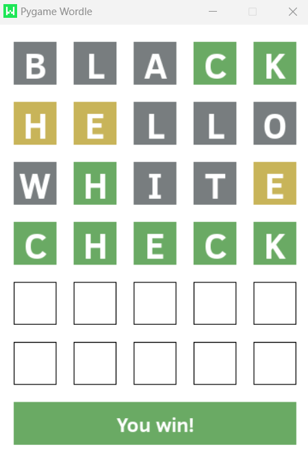

# Pygame Wordle

Wordle is a web-based game. The player have six attempts to guess a five-letter word, with feedback given for each guess in the form of colored tiles indicating when letters match or occupy the correct position. In this repository you will find a python implementation using pygame.

[Official game](https://www.nytimes.com/games/wordle/index.html)

## Game

  

When the player send a word there are three possibilities for every letter:

- Green: correct letter in the correct place
- Yellow: it's contained in the word, but not at this position
- Gray: it isn't contained in the word

You can run the game using `python Wordle.py`. 

### Requirements

- [Python](https://python.org)
- [Pygame](https://www.pygame.org/news)

### Controls 

- A-Z: write
- Enter: send the word
- ESC: exit

## Software Design

This project implements two design patterns to maintain code organization and modularity: the State pattern and the Observer pattern. The State pattern is used to manage the game's current state, which can be one of the following: Playing, Won, Lost, Word not found, or Line not filled. Each state is encapsulated in a separate class with a common interface to enable switching between states and executing state-specific actions without adding conditional statements to the code.

In contrast, the Observer pattern is utilized to display messages to the player based on the current state of the game. The game state acts as the subject, and a text box acts as the observer. Whenever the game state changes, the text box is notified and accesses the current state to display the appropriate message to the player.

By separating concerns, this design enhances the maintainability and scalability of the code. Additionally, we have included a class diagram below to provide a visual representation of our software design.

  

## Optimization

In addition to designing the code with maintainability and modularity in mind, we also optimized the performance of the game to ensure a smooth and enjoyable experience for the player.

Given that Pygame's event loop runs continuously regardless of user input, we optimized the game loop to ensure that it only updates when necessary. In the case of Pygame-Wordle, since there are no animations or events occurring without user input, the game loop waits for user input before updating the game elements.

We also optimized the display of the letter boxes and the player message box. Rather than updating them continuously, we only update them when necessary. This optimization is made possible by the Observer pattern, which notifies the player message box of the game state changes and ensures that it only updates when necessary.

## Words

The list of possible wordle words was taken from [wordle-list](https://github.com/tabatkins/wordle-list), by the user Tabatkins.
